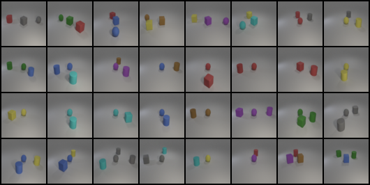
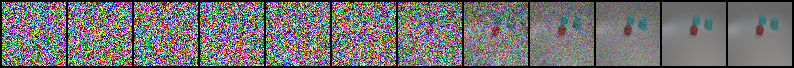

# Conditional DDPM for Multi-Label Image Generation (i-CLEVR)

> **Deep Learning Lab6** — NYCU, Spring 2026  
> Conditional Denoising Diffusion Probabilistic Model with Cross-Attention Conditioning

## Results

| Test Set | Accuracy |
|----------|----------|
| `test.json` | **0.9167** |
| `new_test.json` | **0.9643** |

> Evaluation metric: top-k object classification accuracy using a pretrained ResNet-18 evaluator.  
> Score ≥ 0.8 = full marks (100%).

### Generated Image Grid (`new_test.json`)


### Denoising Process — `["red sphere", "cyan cylinder", "cyan cube"]`


---

## Problem Statement

Given a set of object labels (e.g. `["red sphere", "cyan cylinder", "cyan cube"]`), generate a 64×64 image containing all specified objects. The dataset (i-CLEVR) contains 24 object classes: **8 colors × 3 shapes** (cube / sphere / cylinder), with 1–3 objects per image.

---

## Key Design: Why Cross-Attention?

### The Attribute Binding Problem

Early experiments with a standard multi-hot conditioning vector achieved **0.67 accuracy on single-object** samples but only **0.66 on multi-object** samples. Per-sample analysis revealed a consistent failure mode:

```
Target:    ['brown sphere', 'red cylinder']
Predicted: ['gray sphere',  'red cylinder']   ← color swapped between objects
```

The model knew *which colors and shapes* to draw, but confused *which color belongs to which shape* — a classic **attribute binding** failure. This happens because a single pooled conditioning vector carries no information about which color is paired with which shape.

### Solution: Token Sequence + Cross-Attention

Instead of encoding all labels into one vector:

```
# Before: multi-hot (24,) — loses pairing information
cond = [0, 0, 1, 0, ..., 1, 0]   # "there is a blue thing and a sphere"

# After: token sequence (3, embed_dim) — preserves pairing
tokens = [embed("blue sphere"), embed("red cylinder"), embed(PAD)]
```

Each object becomes an independent token. A **Cross-Attention block** at every U-Net resolution level lets each spatial position in the feature map attend selectively to the most relevant object token:

```
Query  = image feature map positions  (B, H×W, C)
Key    = object token sequence         (B, MAX_OBJS, C)
Value  = object token sequence         (B, MAX_OBJS, C)
```

This allows the model to learn spatial correspondences like "the upper-left region should look like token 0 (blue sphere)" independently of "the lower-right region should look like token 1 (red cylinder)".

**Result: accuracy jumped from 0.67 → 0.92 on test.json after switching to cross-attention.**

---

## Architecture

```
Input: noisy image (B, 3, 64, 64) + timestep t + object token ids (B, 3)
                          │
               ┌──────────▼──────────┐
               │   Token Encoder     │  learnable embedding per object class
               │  (vocab=25, dim=256)│  + positional embedding for slot order
               └──────────┬──────────┘
                          │ cond_tokens (B, 3, 256)
                          │
         ┌────────────────▼────────────────────┐
         │         Conditional U-Net            │
         │                                      │
         │  Encoder                             │
         │  64×64 → ch=128   (ResBlock × 2)    │
         │  32×32 → ch=256   (ResBlock × 2)    │
         │  16×16 → ch=256   (ResBlock + Self-Attn + Cross-Attn) × 2  │
         │   8×8  → ch=512   (ResBlock + Self-Attn + Cross-Attn) × 2  │
         │                                      │
         │  Bottleneck: ResBlock + Self-Attn + Cross-Attn              │
         │                                      │
         │  Decoder (mirrored with skip connections)                   │
         └──────────────────┬──────────────────┘
                            │
                    predicted noise ε (B, 3, 64, 64)
```

**Total parameters: ~70M**

---

## Training Details

| Hyperparameter | Value |
|----------------|-------|
| Diffusion steps T | 1000 (linear β schedule, 1e-4 → 0.02) |
| Training objective | ε-prediction (MSE loss) |
| Dataset | i-CLEVR, 18,009 images (full dataset) |
| Batch size | 64 |
| Optimizer | AdamW (lr=2e-4, weight_decay=1e-4) |
| LR schedule | CosineAnnealingLR (T_max=150, η_min=1e-6) |
| Epochs | 150 |
| EMA decay | 0.9999 (inference uses EMA weights) |
| CFG dropout | 10% (random PAD token conditioning) |
| Inference | DDIM, S=100 steps, η=0.0 |

### Training Progression

Previous attempts revealed two critical failure modes:
1. **Optimizer state contamination** — resuming training with a decayed OneCycleLR optimizer caused loss to start near 0 from epoch 1 (lr ≈ 1e-10), with no actual learning occurring
2. **Overfitting signal** — a final training loss of 0.0007 with low accuracy indicated memorization rather than generalization

Switching to CosineAnnealingLR and ensuring clean optimizer state initialization resolved both issues.

---

## Inference

```python
# DDIM sampling (100 steps, deterministic)
python lab6_conditional_ddpm.py --mode generate --ddim_steps 100

# Generate + build PDF report
python lab6_conditional_ddpm.py --mode report --student_id YOUR_ID --student_name YOUR_NAME
```

---

## Installation

```bash
pip install torch torchvision matplotlib tqdm Pillow numpy
```

**Directory structure expected:**
```
project/
├── lab6_conditional_ddpm.py
├── ddpm_checkpoint.pt          # model weights (Git LFS)
├── file/
│   ├── objects.json
│   ├── train.json
│   ├── test.json
│   ├── new_test.json
│   ├── evaluator.py
│   └── checkpoint.pth          # pretrained ResNet-18 evaluator
└── iclevr/                     # training images (not included)
    └── CLEVR_train_*.png
```

The `iclevr/` dataset and `file/` evaluation assets are not included in this repository. The dataset is available from the course Google Drive.

---

## Ablation: What Actually Drove the Accuracy Gain?

Per-sample error analysis before and after the cross-attention change:

| Error type | multi-hot conditioning | token + cross-attention |
|------------|----------------------|------------------------|
| Single-object wrong | 0% | 0% |
| Multi-object attribute swap | ~34% of samples | rare |
| Overall accuracy | 0.67 / 0.80 | **0.92 / 0.96** |

Note: the cross-attention change was not isolated from other changes (CosineAnnealingLR, clean training restart), so a formal ablation study would be needed to attribute the gain precisely. The error pattern strongly implicates attribute binding as the dominant factor.

---

## References

- Ho et al., *Denoising Diffusion Probabilistic Models*, NeurIPS 2020
- Song et al., *Denoising Diffusion Implicit Models*, ICLR 2021
- Rombach et al., *High-Resolution Image Synthesis with Latent Diffusion Models*, CVPR 2022 (cross-attention conditioning)
